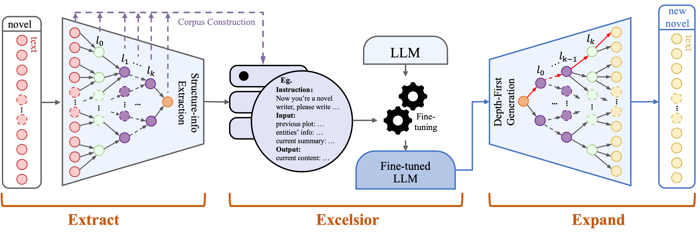

# Ex3 : Automatic Novel Writing by Extracting, Excelsior and Expanding

Pytorch implementation of [Ex3 : Automatic Novel Writing by Extracting, Excelsior and Expanding](https://arxiv.org/pdf/2408.08506) which proposes a framework to automatically construct storyline by learning from raw novels, and generate new novels that imitate the linguistic style of a specific genre.



## instruction
### Preparation
Raw novel should be transfered to json like:
```json
{
    "book_title": "Gone with the wind",
    "author": "Margaret Mitchell",
    "tag": "war, romantic",
    "chapters": [
        {
            "chapter_title":"",
            "chapter_content":""
        },
        {
            "chapter_title":"",
            "chapter_content":""
        },
        ...
    ]
}
```
And you need an LLM and an embedder.

### Stage 1: Extracting
After preparation, specify the path to your `dataset`, `LLM` and `embedder` in ```./Extracting/main_extracting.py```. Then run:

```
cd ./Extracting
python main_extracting.py
``` 

It will finish the chapter extracting and recursively extracting. And relative infomation will be record in fold ```./shrinker_info```. And the corpus will be stored in the output_dir specified before. Raw novel will be divided into lots of json files, like:

```
- Gone with the wind
|-- 0.json
|-- 1.json
|-- ...
|-- level_0.json
|-- level_1.json
|-- ...
|-- level_gonewiththewind.json
```

The dataframe in each json file can be looked up in ```get_summary.py```.

Then specify your `dir`, `LLM path` and `ing_info_path` in ```main_entity.py```, and run. It will use Entity Extraction method to update your corpus. Dataframe canbe looked up in ```Entity_info.py```. And the process information will be record in `ing_info_path`.


### Stage 2: Excelsior
After we get the summaries and entity information within a novel, we need to construct our corpus for fine-tuning the LLM later. In `./Excelsior/main_corpus_constructor.py`, specify the `LLM path`, `input_dir` and `output_dir`. Note the `input_dir` and `output_dir` should be different. Then run:

```
cd ./Excelsior
python main_corpus_constructor.py 
```
The corpus will be generated in `output_dir` as a json file for each novel. And the corpus is ready for fine-tuning the LLM. Scripts for fine-tuning training can be flexibly selected according to the LLM you utilize.


```
ps: The names of some functions or classes in this stage use the word "expand", which is only in contrast to the "shrinker" in the name of the function in the first stage, which has nothing to do with the third stage of Expanding.
```

### Stage 3: Expanding
In Expanding stage, you need two LLMs. One is the fine-tuned novel writer, and the other is a general LLM for entity extraction. Specify the pathes and start.

Note that we give premises in the ```./Expanding/main_writing.py```. The premises should contain `novel_title`, `novel_tags`, and `novel_intro`. This is specified for evaluation. If you don't want to specify premises, you at least need to give novel tags and just set title and intro as `None`, the writer will automatically do the initialization.

Other hyperparameters can be looked up in ```./Expanding/main_writing.py```

Plus, we provide a demo for interact with the Ex3-NovelWriter. User can read the outlines it outputs and edit them if you like.


## Citation
```
@inproceedings{DBLP:conf/acl/LeiGHZZPL024,
  author       = {Huang Lei and
                  Jiaming Guo and
                  Guanhua He and
                  Xishan Zhang and
                  Rui Zhang and
                  Shaohui Peng and
                  Shaoli Liu and
                  Tianshi Chen},
  title        = {Ex3: Automatic Novel Writing by Extracting, Excelsior and Expanding},
  booktitle    = {{ACL} {(1)}},
  pages        = {9125--9146},
  publisher    = {Association for Computational Linguistics},
  year         = {2024}
}
```